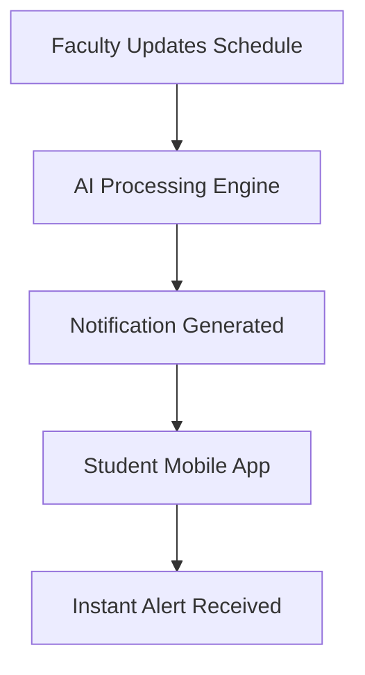

# 🚀 AI-in-Campus-Parul-Hackathon
## 🥔 Team Aalo Tikki

# 📢 Lecture & Lab Notification App

<div align="center">


<br>


</div>

---

# 🌟 Overview

In a fast-moving campus environment, students often miss important updates regarding:

- 📚 Lecture rescheduling
- 🧪 Lab timing changes
- 🏫 Room swaps
- ⚠️ Emergency notices
- 📢 Faculty announcements

Our solution solves this chaos using **AI-powered real-time notifications**.

The **Lecture & Lab Notification App** instantly informs students through smart mobile alerts — ensuring everyone stays updated, organized, and stress-free.

---

# 💡 Problem Statement

> “Students frequently miss lecture/lab updates due to scattered communication channels.”

Traditional communication methods like WhatsApp groups, notice boards, or manual announcements are:

- Slow ⚡
- Unorganized 📉
- Easy to miss ❌

---

# ✅ Our Solution

🎯 A centralized AI-enabled campus notification system that provides:

- ✨ Instant push notifications
- ✨ Smart timetable synchronization
- ✨ AI-generated priority alerts
- ✨ Faculty dashboard for announcements
- ✨ Real-time room & schedule updates
- ✨ Personalized student notifications

---

# 🧠 AI Features

| Feature | Description |
|----------|-------------|
| 🤖 Smart Alert Prioritization | AI categorizes urgent vs normal updates |
| 📍 Context-Aware Notifications | Alerts based on department, semester & subjects |
| 🔔 Intelligent Reminder System | Reminds students before lecture/lab starts |
| 📊 Analytics Dashboard | Tracks notification engagement |
| 🧾 Auto Summary Generator | AI summarizes lengthy announcements |

---

# 📱 App Flow



---

# 🎨 UI/UX Highlights

- 🌌 Modern Glassmorphism Design
- 🌙 Dark/Light Theme Support
- ⚡ Smooth Real-Time Updates
- 📱 Mobile-First Experience
- 🎯 Minimal & Student-Friendly Interface

---

# 🛠️ Tech Stack

<div align="center">

| Frontend | Backend | AI | Database | Notifications |
|----------|----------|----|-----------|---------------|
| Flutter / React Native | Node.js / Firebase | OpenAI APIs | MongoDB / Firebase | Firebase Cloud Messaging |

</div>

---

# 🔥 Key Features

## 📢 Instant Notifications
Get alerts immediately whenever a lecture or lab changes.

## 🧪 Lab Update System
Receive latest experiment instructions, equipment alerts, and venue changes.

## 🏫 Smart Room Tracking
Never get lost again — automatic classroom/lab location updates.

## 👨‍🏫 Faculty Dashboard
Teachers can send updates in one click.

## 📅 Timetable Sync
Auto-sync with student schedules for personalized alerts.

---

# 🚀 Future Scope

- 🎙️ Voice Assistant Integration
- 🧠 AI Chatbot for Student Queries
- 📍 Indoor Navigation to Classrooms
- 📈 Attendance Prediction System
- 📡 IoT-Based Smart Campus Integration

---

# 👥 Team Aalo Tikki

<div align="center">

| Name | Role |
|------|------|
| 👨‍💻 Team Member 1 | AI Development |
| 📱 Team Member 2 | App Development |
| 🎨 Team Member 3 | UI/UX Design |
| ☁️ Team Member 4 | Backend & Database |

</div>

---

# 🏆 Hackathon Theme

## 🎓 AI in Campus

This project aligns with the vision of creating:

- Smart Campuses 🏫
- Connected Students 📡
- Efficient Communication ⚡
- AI-Driven Academic Ecosystems 🤖

---

# 📸 Preview

```txt
📲 “Your DBMS Lab has been shifted to Lab 3 at 2:00 PM.”
🔔 “Machine Learning lecture postponed by 30 minutes.”
⚠️ “Chemistry Lab cancelled due to maintenance.”
```

---

# ⚙️ Installation

```bash
# Clone the repository
git clone https://github.com/your-username/AI-in-Campus-Parul-Hackathon.git

# Navigate into project
cd AI-in-Campus-Parul-Hackathon

# Install dependencies
npm install

# Run the project
npm start
```

---

# 🌈 Why This Project Stands Out

✅ Solves a real campus problem  
✅ Uses AI meaningfully  
✅ Improves communication efficiency  
✅ Student-centric design  
✅ Scalable for universities worldwide

---

<div align="center">

# ⭐ Smart Notifications for a Smarter Campus ⭐

### Made with ❤️ by Team Aalo Tikki

</div>
